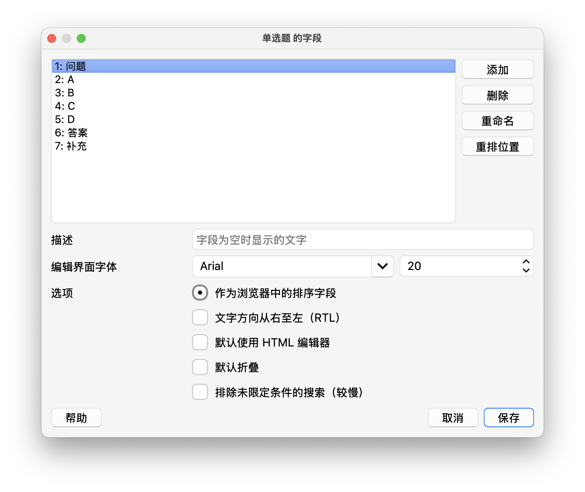
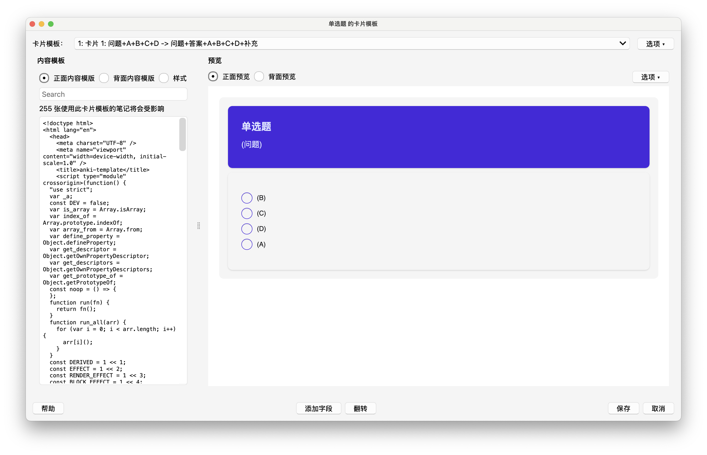

# 项目运行

使用 turbo+pnpm 构建的单仓库项目
使用方法：

1. 安装 nodejs 去官网下载最新版本
   `https://nodejs.org/zh-cn`
   安装完后，重启电脑或者终端，使用 node -v 查看版本号
2. 安装 pnpm
   `https://www.pnpm.cn/`
   安装完后，重启电脑或者终端，使用 pnpm -v 查看版本号
3. 安装依赖
   `pnpm install`
4. 启动项目
   `pnpm dev`
5. 浏览器访问
   `http://localhost:5173/`
   如成功打开网站，证明安装成功

# anki 加入模板（单选题为例）

### 首先 anki 要有对应的字段

1. 打开 anki

2. 点击 工具 -> 笔记模板 -> 添加 -> 点击【添加：问答题】 -> 输入名称（随意）

3. 列表中选择刚才添加的模板

4. 点击字段

5. 添加或修改，保证字段名为 【A】【B】【C】【D】【问题】【答案】【补充】
   
   

6. 点击 【保存】

7. 列表中选择刚才添加的模板

8. 点击【卡片】

9. 这时候就可以看到正面模板、背面模板和样式

10. 点击样式单选，删除里面所有内容。

### 项目打包对应代码

> 项目使用 svelte + tailwind + daisyui

1. 进入 /app/anki-template/src/App.svelte 这个文件，修改第二行

```js
import TEMp from "./pages/MCQs/Back.svelte";
```

`MCQs`文件夹 是单选题
`Back.svelte` 是背面模板，`Front.svelte` 正面模板

如果想打包正面模板，就改成

```js
import TEMp from "./pages/MCQs/Front.svelte";
```

2. 项目根目录运行 `pnpm build`（如果刚刚运行 pnpm dev 使用 (win)ctrl + c 或 (mac) cmd + c 停止）就打包成功了

3. 找到 /app/anki-template/dist/index.html 这个文件，这个就是打包好的内容，全选粘贴替换 anki 中对应的模板


